# INSTALLATION

## Table of Contents
1. [Requirements](#requirements)
2. [Create an Amazon Alexa Skill](#create-an-amazon-alexa-skill)
3. [Create an AWS Lambda Function](#create-an-aws-lambda-function)
4. [Add Code to the Lambda Function](#add-code-to-the-lambda-function)
5. [Getting the home_assistant_agent_id](#getting-the-home_assistant_agent_id)
6. [Test the Lambda Function](#test-the-lambda-function)
7. [Configure the Skill Service Endpoint](#configure-the-skill-service-endpoint)
8. [Account Linking](#account-linking)
9. [Enabling room recognition](#enabling-room-recognition)
10. [Enabling skill on Alexa App](#enabling-skill-on-alexa-app)
11. [Alexa Locale](#alexa-locale)

---

## Requirements
- This Alexa Skil requires your Home Assistant instance to be accessible from the Internet via HTTPS on port 443 using an SSL/TLS certificate. A self-signed certificate will not work, but a public trusted certificate or a certificate signed by an Amazon-approved certificate authority should work.
- An Amazon Developer Account. Sign up [here](https://developer.amazon.com/).
- An Amazon Web Services (AWS) account is required to host the Lambda function for your Alexa Smart Home Skill. AWS Lambda is free to use for up to 1 million requests and 1GB outbound data transfer per month.

## Create an Amazon Alexa Skill
- Sign into the [Alexa Developer Console](https://developer.amazon.com/alexa/console/ask). You can create your free account on the sign-in page.
_Note: This must be created with the same `Amazon account` you use on your Alexa devices and app._
- Go to the `Alexa Skills` page if you are not already there, then click the `Create Skill` button to start the process.
- In the `Name, Locale` step: Input the `Skill name` as you like, then select your skill’s Default `language` and click `Next`. _**Important**: The language of your skill must be the same as the language of your Amazon/Alexa account. [More information about supported languages here](../../README.md#supported-languages)_
- In the `Experience, Model, Hosting service` step: Select `Other` > `Custom` > `Provision your own`, then click `Next`.
- In the `Template` step: Select `Start from Scratch` and click `Next`.
- Review and click `Create Skill`.

  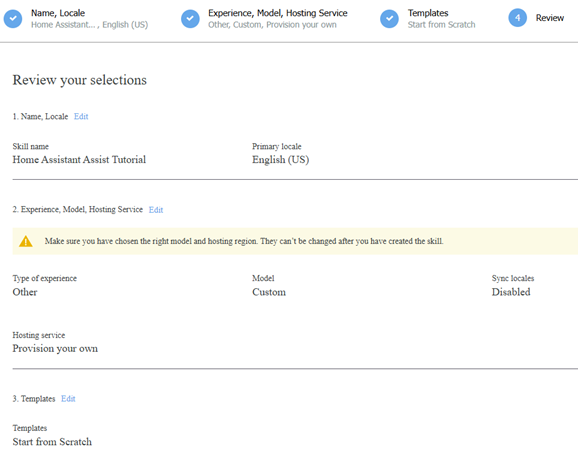
- This may take a few seconds, please wait…
- In the next screen, you will see some options, and in the right panel `Building your skill`, follow these steps:

  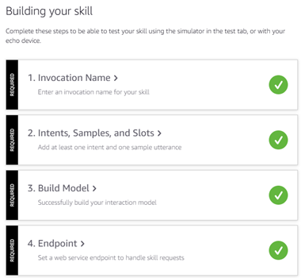

  - Click `Invocation Name >` change the default invocation as you like, then click `Save`.
  - In the left-side navigation manu, go to `CUSTOM` > `Interaction Model` > `JSON Editor`, and drag and drop [`interactionModels.json` file](../interactionModels.json), then click `Save`.

  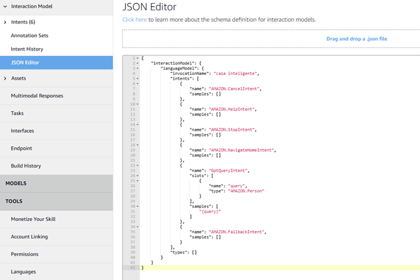

  - Still in the left-side navigation manu, go to `CUSTOM` > `Interfaces`, scroll down to `Alexa Presentation Language`, enable it, and uncheck `Hub Round` _(This skill is not compatible)_.

  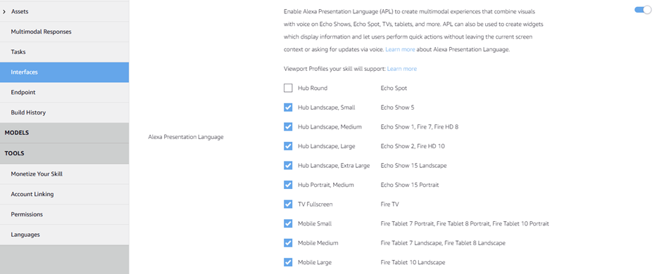

  - Now, go to `CUSTOM` > `Endpoint` and take note of `Your Skill ID`.
- You have created a skeleton of the skill. In the next step, we will do some developer work, but keep the `Alexa Developer Console` opened, as we will need to change the skill configuration later.

## Create an AWS Lambda Function
We will write a small piece of code hosted as an `AWS Lambda function` that will redirect requests from the Alexa skill to your Home Assistant instance. Make sure that you have the API enabled in Home Assistant because it will process the request and send back the response. The Lambda function will then deliver the response back to the Alexa skill.

First, you need to sign in to your [AWS console](https://aws.amazon.com/console/). If you don’t have an AWS account yet, you can create a new user with the 12-month free tier benefit. You don’t need to worry about the cost if your account has already passed the first 12 months, as AWS provides up to 1 million Lambda requests, 1GB of outbound data, and all inbound data for free every month for all users. See [Lambda pricing](https://aws.amazon.com/lambda/pricing/) for more details.

## Add Code to the Lambda Function
Next, you need to create a Lambda function.
- Click `Services` in the top navigation bar, expand the menu to display all AWS services, then under the `Compute` section, click `Lambda` to navigate to the Lambda console or use the search field _(Tip: Add `Lambda` as favorite)_.
- **IMPORTANT** - Alexa Skills are only supported in certain AWS regions. Your current server location will be displayed in the top-right corner (for example, Ohio). Select an available server below that is closest to your location and in your region, based on your Amazon account’s country. Alexa Lambda functions created on other servers will not work properly and may prevent account linking!
  - **US East (N. Virginia)** region for americas: `English (US)`, `English (CA)`, `Portuguese (BR)` skills.
  - **EU (Ireland)** region for `English (UK)`, `Intalian`, `German (DE)`, `Spanish (ES)`, `French (FR)`skills.
  - **US West (Oregon)** region for `Japanese` and `English (AU)` skills _(not tested yet)_.
- Click `Functions` in the left navigation bar to display the list of your Lambda functions.
- Click `Create function`:
  - Select `Author from scratch`, then input a Function name like `HomeAssistantAssist`.
  - Select **Python 3.12** as the Runtime and **x86_64** architecture.
  - Don’t change the `default execution role`, leave it as default `Create a new role with basic Lambda permissions`.
- Click `Create function`, then configure the details of the Lambda function.

  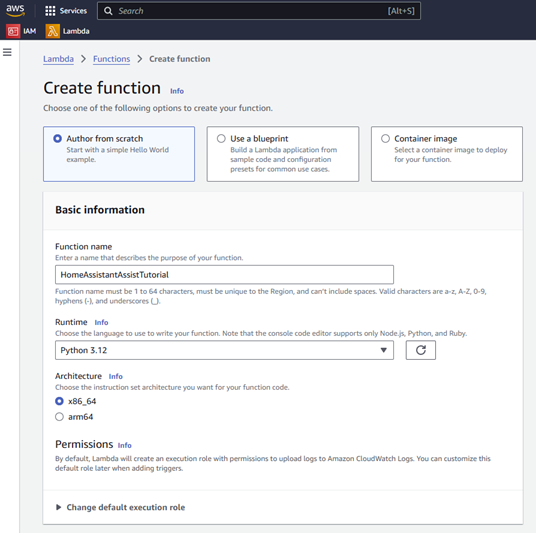

- Expand the `Function overview` (if it isn’t already expanded), then click `+ Add trigger` on the left part of the panel, then select `Alexa` from the drop-down list to add an Alexa trigger to your Lambda function.

  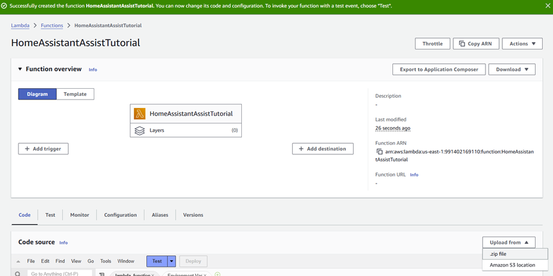

- Select `Alexa Skills Kit` and input the `Skill ID` from the skill you created in the previous step. _(Tip: You may need to switch back to Alexa Developer Console to copy the Skill ID.)_, then click the `Add` button.

  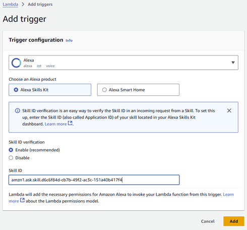

- Now scroll down to the `Code` tab > `Code source`, then click the `Upload from` button on the right and select `zip file`.
  - Upload the `lambda_function.zip` downloaded from the [latest releases](https://github.com/fabianosan/HomeAssistantAssistAWS/releases/download/lambda_functions_v0.6/lambda_functions_v0.6.zip).
  - All the code will be replaced by the uploaded file, and you can’t edit it _(If you want to edit any files, do it in your station before this step)_.
- Click on `Deploy` button to publish the updated code.
- Navigate to the `Configuration` tab, select `Environment variables` on the left navigation menu. You need to add `at least one environment variable` from the list below. The remaining variables are `optional`, but they configure specific features in the skill's operation. To add a variable, click on  `Edit` button, then add the following key and values:

  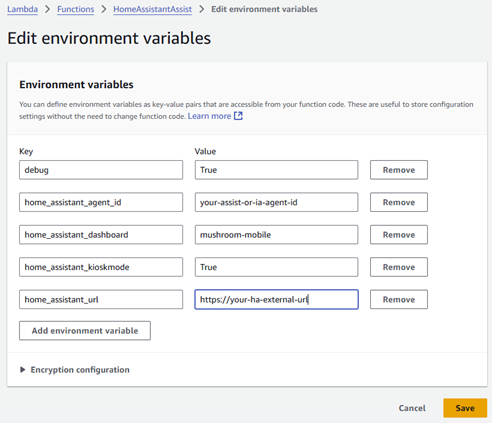
  - (required) Key = **home_assistant_url**, Value = your Home Assistant instance’s Internet accessible URL _(on 443 port)_. _Do not include the trailing `/` at the end._
  - (optional) Key = **home_assistant_agent_id**, Value = Your Assist Agent ID. [Instructions here](#getting-the-home_assistant_agent_id)
  - (optional) Key = **home_assistant_language**, Value = Your Assist Language. _(The default is the Assist configured language)_
  - (optional) Key = **home_assistant_room_recognition**: Enable the device area recognition mode with `True`. **Attention**, it only works with AI. If using the default Assist, disable this option, as no commands will work (this includes the new `Assist fallback` feature introduced in HA 2024.12 that will no longger work too).
  - (optional) Key = **home_assistant_dashboard**, Value = Your dashboard path name. Example: `mushroom`. _(The default is `lovelace`)_
  - (optional) Key = **home_assistant_kioskmode**, Value = `True`. Set this variable to enable KIOSKMODE. _(Make sure you have this component installed, up, and running in your Home Assistant instance)._
  - (optional) Key = **debug**, Value = `True`. Set this variable to log the debug messages and allow the `home_assistant_token` environment variable.
  - (optional, _not recommended_) Key = **home_assistant_token**, Value = Your Home Assistant Long-Lived Access Token. You will connect your Alexa Skill with your Home Assistant user account in the later steps, meaning you don’t need to add it here. However, you can add it here for debugging purposes. _(You should remove and delete this environment variable after debugging is finished)_.
- Click the **Save** button in the bottom right-hand corner.
- **Important:** If you are using a IA model, or your Home Assistant API response is `more than 3 seconds` _(default configuration)_, you need to increase the function timeout, follow the steps below to change:
  - Remain in the `Configuration` tab, go to `General configuration`, click `Edit` in the right of the panel, now edit basic settings, in the `Basic settings` panel, and `Time out` field you can change to 30, 60 seconds or the time you need.
  - Click `Save` in the bottom right.

    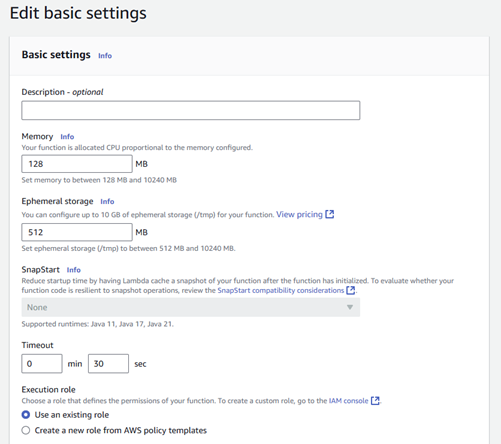

## Getting the `home_assistant_agent_id`:

- With your Home Assistant open, navigate to **Developer Tools**, go to the `Actions` tab and follow the steps below:

1. Search for `conversation.process` in the actions field and select:


2. Activate the `Agent` field and select the desired conversational agent from the list:


3. Switch to `YAML MODE` and copy the ID that is in the `agent_id` field:


## Test the Lambda Function
Now, you have created the Lambda function, and you are going to do a basic test.
- Navigate to the `Test` tab, then select `Create new event`.
- Name your event as you like, for example: `AssistTest`.
- Enter the following data into the code box named `Event JSON`:

```json
{
    "version": "1.0",
    "session": {
      "new": true,
      "sessionId": "SessionId.sample-session-id"
    },
    "context": {
      "System": {
        "application": {
          "applicationId": "amzn1.ask.skill.sample-application-id"
        },
        "user": {
          "userId": "amzn1.ask.account.sample-user-id",
          "accessToken": "sample-access-token"
        },
        "device": {
          "deviceId": "amzn1.ask.device.sample-device-id",
          "supportedInterfaces": {
            "Alexa.Presentation.APL": {}
          }
        }
      }
    },
    "request": {
      "type": "LaunchRequest",
      "requestId": "sample-request-id",
      "timestamp": "2024-10-18T00:00:00Z",
      "locale": "en-US"
    }
}
```

- Click `Save` in the top right-hand corner of the panel.
- Log in to your Home Assistant and generate a `long-lived access token`. After entering your long-lived access token into the environment variable `home_assistant_token` and setting the `debug` environment variable to `True`, you can execute the test.
- To test, click `Test` in the top right-hand corner of the panel.
- If the test goes well and everything is OK with your function, the result will appear highlighted in green as `Executing function: succeeded`, This means the skill was started correctly.

  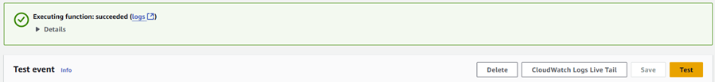

## Configure the Skill Service Endpoint
Now, remove the `long-lived access token` _(if you want, recommended)_ from the environment variables and delete it from your Home Assistant.
- Still in the `AWS Console`, copy the `Function ARN` of your Lambda function.
- Return to the `Alexa Developer Console`, and go to the `Alexa Skills` page _(if you are not there already)_.
- Find the skill you just created, and click the `Edit` link in the `Actions` dropdown list.
- Go to `CUSTOM` > `Endpoint` in the left navigation bar of the `Build` page.
- Paste the `Function ARN` copied from your Lambda function in the `Default region` field and click the `Save` button in the upper right corner.

  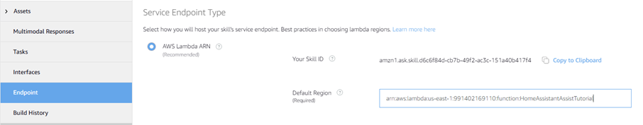

## Account Linking
Alexa needs to link your Amazon account to your Home Assistant account. Therefore, Home Assistant can ensure only authenticated Alexa requests can access your API.
In order to link the account, you have to make sure your Home Assistant can be accessed from the Internet on port 443.
- Return to the `Alexa Developer Console`, and go to the Alexa Skills page _(if you are not there already)_.
- Find the skill you just created, and click the `Edit` link in the `Actions` dropdown list.
- Click `ACCOUNT LINKING` in the left navigation bar of the `Build` page.
- `Check` the **Do you allow users to create an account or link to an existing account with you?** switch.
- In `Settings`, `uncheck` the **Allow users to enable skill without account linking** switch.
- Scroll down and make sure that `Auth Code Grant` is selected.
- Input all information required. Assuming your Home Assistant can be accessed by `https://[YOUR HOME ASSISTANT URL]`. For Alexa account linking, by default, the standard port 443 is used _(use your firewall to forward this, if needed)_:
  - **Your Web Authorization URI**: https://[YOUR HOME ASSISTANT URL]/auth/authorize
  - **Access Token URI**: https://[YOUR HOME ASSISTANT URL]/auth/token
  **Note:** Although it is possible to assign a different port, Alexa requires you to use port 443, so make sure your firewall/proxy is forwarding via port 443. _(Read more from the [Alexa developer documentation](https://developer.amazon.com/en-US/docs/alexa/smarthome/build-smart-home-skills-account-linking.html) about requirements for account linking)_.
Despite the Alexa documentation’s disclaimer, however, `Let’s Encrypt` certificates are still accepted.
**Important:** You must use a `valid/trusted SSL certificate` for account linking to work. Self-signed certificates will not work, but you can use a free `Let’s Encrypt` certificate.
  - **Your Client ID**:
    - https://pitangui.amazon.com/ if you are in Americas.
    - https://layla.amazon.com/ if you are in Europe.
    - https://alexa.amazon.co.jp/ if you are in Japan, Australia _(not verified yet)_.

    **Important:** The trailing slash is important here _(don’t change the URL above)_.
  - **Your Secret**: Input anything you like; Home Assistant does not check this field.
  - **Your Authentication Scheme**: Make sure you selected `Credentials in request body`. _(Home Assistant does not support HTTP Basic)_.
  - You can leave `Scope`, `Domain List`, and `Default Access Token Expiration Time` as empty.
- Click the `Save` button in the top right corner.
- Click `CUSTOM` in the left navigation bar of the `Build` page and `Build Skill` in the top right corner.

  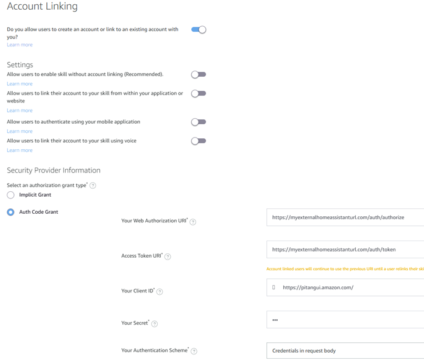

### Enabling room recognition
- **(ONLY WORKS WITH AI)** In this mode, the skill sends the device ID (of the `echo` device running the skill) in the Home Assistant conversation API call. With a command instruction for the AI and a label associated with the device, the AI can identify the devices in the same area as your `Alexa`. To activate, follow the steps below:

  ***Attention!***
  ## This mode slows down commands and requires more complex configurations. Additionally, it does not work with the "Assist fallback" mode enabled, which was introduced in version 2024.12 of HA:
  1. Change the `home_assistant_room_recognition` configuration to `True` and perform a new `deploy`;
  2. Enable conversation API debug logging by adding the following configuration to the Home Assistant `configuration.yaml` file:
     ```yaml
     logger:
       logs:
         homeassistant.components.conversation: debug
     ```
  3. Restart Home Assistant and start the skill from the desired echo device. After activation, the log will display the instruction received by the skill as shown in the example below:
     ```txt
     2024-10-10 11:04:56.798 DEBUG (MainThread) [homeassistant.components.conversation.agent_manager] Processing in pt-BR: ligue a luz da sala. device_id: amzn1.ask.device.AMAXXXXXX
     ```
     You can also obtain the device_id from the "device: " log using the `AWS Developer Console` > `Monitor` > `Cloud Watch logs` if you know how to do it.
  4. Take the entire identifier following the device_id, e.g., `amzn1.ask.device.AMAXXXXXX`, and add a new label to the **echo device** via the `Alexa Media Player` Integration:

     

  5. Update the **AI command prompt** of your choice with the instruction below or try one that your AI understands:
     ```txt
     If an action is requested on a device and its area is not provided, capture the identifier found after "device_id:" in the command, retrieve the label with the same identifier, and associate the area of that label with the device to determine which area the device belongs to.
     ```

## Enabling skill on Alexa App
- You need to use the `Alexa Mobile App` to link your account.
  - In the `Alexa app`, navigate to `More` > `Skills & Games` > `Your Skills` -> `Dev`.
  - Click on the skill you just created.
  - Click `Enable to use`.
  - A new window will open to direct you to your Home Assistant’s login screen.
  - After you successfully log in, you will be redirected back to the Alexa app.
  - Now, you can ask Alexa from your Echo device or the Alexa App to open the skill like **Alexa, [your Invocation Name]**.

## Alexa Locale
The locale should match the location and language used for your Amazon Echo devices.
_The current supported skill locales are described in main page page._
